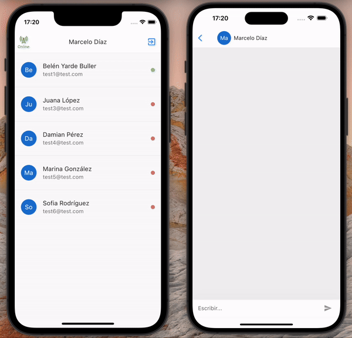
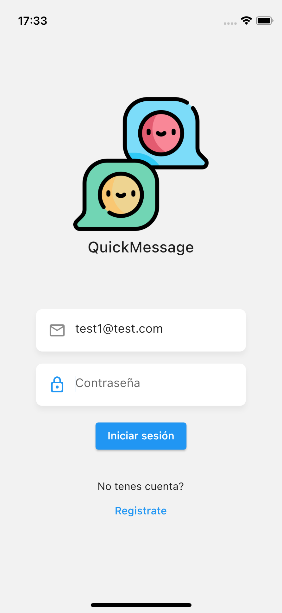
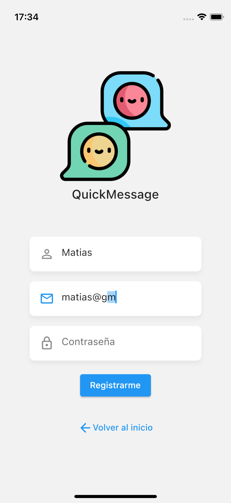
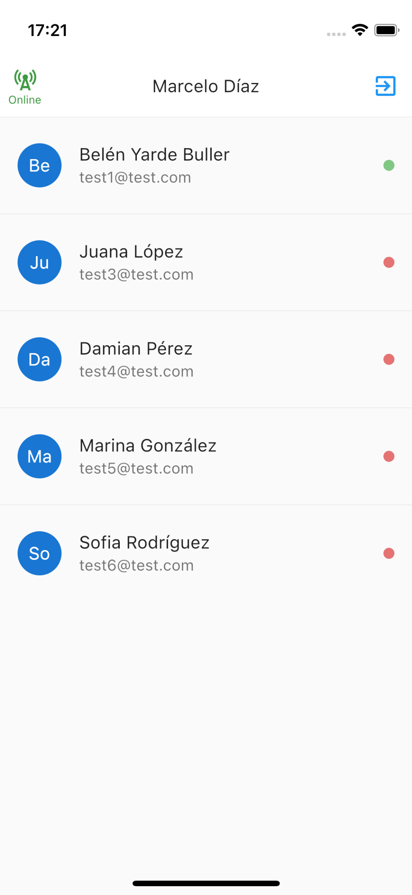
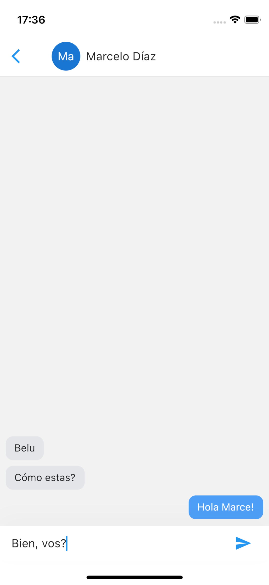

# Chat App

This Flutter chat app is a real-time messaging application that allows users to engage in seamless conversations. The app is built using Flutter for the front end, and it communicates with a Node.js backend server that utilizes Express, MongoDB for data storage, and sockets for real-time communication.



## Frontend Features
To check out this repo, click [here](https://github.com/belenyb/chatapp_frontend.git).
### Login and Signup Pages
The app includes dedicated pages for user authentication, allowing users to log in or sign up to access the chat functionality.





### App bar
This widget includes two main actions: a signout button and an online status icon, which represents the socket server's status.

### Users Page
A user list page displays all users along with their online status. Users can easily identify who is online and initiate chats.


### Chat Page
The chat page provides a user-friendly interface for users to engage in real-time conversations. The chat history between two users is displayed, and new messages are instantly updated.



## Backend features
To check out this repo, click [here](https://github.com/belenyb/chatapp_backend.git).
### Real-time Messaging
Users can send and receive messages in real-time, providing a smooth and interactive chat experience.

### User Authentication with JWT
Secure user authentication is implemented using JSON Web Tokens (JWT), ensuring a safe and personalized messaging experience.

### MongoDB Integration
Messages and user data are stored in a MongoDB database. MongoDB Compass, a graphical user interface, can be used for easy database management. Additionally, MongoDB Atlas, a cloud-based database service, offers a scalable and reliable solution for data storage.

### Socket.io
Real-time communication is achieved through Socket.io, enabling instant message updates and notifications.


### Backend dependencies
#### bcryptjs
Passwords are securely hashed using bcrypt to enhance user authentication.

#### cors
Cross-Origin Resource Sharing (CORS) is handled using the cors package to enable secure communication with the frontend.

#### dotenv
The dotenv package is used to load environment variables from a .env file.

#### express
The server framework used for handling HTTP requests and routes.

#### express-validator
Input validation is performed using the express-validator package.

#### jsonwebtoken
JSON Web Tokens (JWT) are used for secure user authentication.

#### mongoose
A MongoDB object modeling tool used for interacting with the MongoDB database.

#### socket.io
Enables real-time bidirectional event-based communication.

## API Reference

### Auth endpoints

#### 1. Sign up

```http
  POST /api/auth/signup
```

```
{
    "name": "Belen",
    "email": "test1@test.com",
    "password": "123456"
}
```

#### 2. Sign in

```http
  POST /api/auth/login
```

```
{
    "email": "test1@test.com",
    "password": "123456"
}
```
### Secure endpoints
##### Authorization header
```
{
    "x-token": token
}
```
#### 3. Regenerate token

```http
  GET /api/auth/renew
```

#### 4. Get users

```http
  GET /api/users?offset=0
```

| Parameter    | Type     | Description                       |
| :-------- | :------- | :-------------------------------- |
| `offset`  | `int`    | Optional  |

#### 5. Get messages

```http
  GET /api/messages/:uid
```
